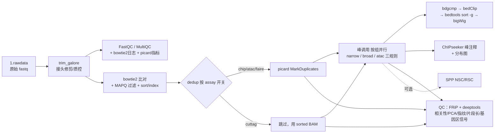

# chip_cuttag_atac_faire

基于 **Snakemake** 的植物表观组学一站式分析流程，单入口 `workflow/Snakefile` 同时支持四种数据类型（可混型项目）：

| Assay | 典型用途 | 峰调用策略 | 去重策略 |
|---|---|---|---|
| **ChIP-seq** | 组蛋白修饰 / TF 结合 | MACS2（narrow：H3K27ac/H3K4me3 等；broad：H3K27me3 等） | picard 去重 |
| **CUT&Tag** | 低背景组蛋白修饰 / TF | MACS2（narrow/broad 按需） | 不去重（保留 PCR 重复） |
| **ATAC-seq** | 染色质开放区 | MACS2 BAMPE 模式（ENCODE ATAC v2 做法；可切经典 Tn5 偏移配方） | picard 去重 |
| **FAIRE-seq** | 染色质开放区（历史方法） | 同 ATAC | picard 去重 |

去重策略、峰参数、QC 开关均按 assay 在 `config/config.yaml` 中配置。默认示例参考基因组为水稻 *Oryza sativa*（IRGSP-1.0），更换物种只需修改参考文件路径与基因组大小。

> ✅ **当前状态（v0.3.0）**：Phase 1~3 重构 + 运维审查 P1/P2/P3 修复完成——单入口 + 全新规则 + per-rule conda 环境 + FRiP/deeptools QC + config 集中校验 + 集群健壮参数 + 45 项单元测试 + CI。已通过 bash 语法检查、假 snakemake 路由验证与独立代码审查（ship）。**尚未在服务器用真实数据完成端到端实跑**（见 [已知限制](#7-已知限制)）。

---

## 1. 流程总览



**运行目录约定**（在数据工作目录生成，与分析代码目录分离）：

```
workdir/
├── config.local.yaml   # 可选：本工作目录的配置覆盖（不进版本库）
├── sample_info.csv     # 样本表（或指向仓库内样本表）
├── 0.index/            # bowtie2 索引（可复用）
├── 1.rawdata/          # 原始数据：{sample}_1.fq.gz / {sample}_2.fq.gz
├── 2.cleandata/        # trim 后数据 + fastqc + multiqc
├── 3.align/bowtie2/    # *_sorted.bam / *_rmdup.bam / *_dup_metrics.txt
├── 4.peak/             # MACS2 峰文件 + *_FE.bw + anno_result/
├── 5.QC/frip/          # FRiP 汇总表
├── 5.QC_deeptools/     # 相关性热图/PCA/指纹图/片段长/基因区信号
├── 5.QC/spp/           # 可选：NSC/RSC/片段长估计
└── logs/               # 各步骤日志
```

## 2. 仓库结构

```
chip_cuttag_atac_faire/
├── workflow/               # 标准 Snakemake 布局
│   ├── Snakefile           # 统一入口：CHIP_CONFIG 加载 + include 编排
│   ├── rules/              # common(共享定义) + upstream/dedup/callpeak/annotation/frip/qc_deeptools/spp_qc
│   ├── scripts/            # 峰注释 R 脚本（annoPeak_batch.R）
│   └── profile/            # default/pbs profile（Phase 3 扩为四套）
├── envs/                   # per-rule conda 环境（--use-conda 自动创建；Phase 2 起改统一环境）
├── scripts/                # 独立 QC 工具（ChIPQC/DROMPAplus，待归档）
├── config/config.yaml      # 默认配置；config.template.yaml 为覆盖模板
├── config/samples.csv      # 样本表模板（四 assay 混型 schema）
├── main_run.sh             # 启动脚本（本机/PBS 集群、config.local 叠加）
├── tests/run_tests.py      # 零依赖单元测试（45 项）
├── Makefile                # make check / lint / dryrun
├── .github/workflows/ci.yaml  # CI：测试 + shellcheck + snakemake --lint
├── docs/                   # REVIEW.md 审查报告 / IMPROVEMENT_PLAN.md 优化计划
└── legacy/                 # v0.1.0 原始实现归档（不可运行，仅参考）
```

## 3. 环境要求

- Linux + conda/mamba + Snakemake，版本矩阵：

| snakemake 版本 | 支持情况 | 说明 |
|---|---|---|
| **7.32.4** | ✅ 参考版本 | 流程 conda 部署 flag（`--use-conda`）以此为准；服务器首次部署推荐 |
| **8.x** | ✅ 自动适配 | `main_run.sh` 自动切换为 `--software-deployment-method conda`（`--use-conda` 在 8.x 已弃用）；CI 用 8.x 验证 `--lint`/解析 |
| <7 或 ≥9 | ⛔ 未验证 | 9.x 可能移除弃用别名，需实测 |

- 其余工具（trim_galore、fastqc、multiqc、bowtie2、samtools、picard、macs2、bedtools、deeptools、R/ChIPseeker 等）由 conda 按 `envs/*.yaml` 自动创建，无需手动安装
- 可选：PBS 集群（`main_run.sh -p`）；Docker（DROMPAplus 独立工具）

## 4. 快速开始

### 4.1 准备原始数据

fastq 放入工作目录 `1.rawdata/`，命名 `{sample}_1.fq.gz` / `{sample}_2.fq.gz`（常见 R1/R2 后缀可用 `main_run.sh -r` 自动重命名）。

### 4.2 编写样本表

复制 `config/samples.csv` 修改（列固定，逐行校验、错误信息含行号）：

```csv
sample_id,role,group,seqtype,layout,peak_type
myc,treat,myc_vs_IgG,chip,PE,narrow
IgG,control,myc_vs_IgG,chip,PE,narrow
atac_leaf_1,treat,atac_leaf,atac,PE,none
```

- `sample_id`：样本名，须与 fastq 前缀一致，仅允许 `字母数字 . _ -`（不含连续 `__`）；**对照组（IgG/Input）也要列**，对照同样需要比对
- `role`：`treat` 或 `control`；`group`：峰调用分组名；同一分组可含多个 treat/对照（MACS2 多文件输入）
- `seqtype`：`chip` / `cuttag` / `atac` / `faire`（混型项目按行混填）
- `layout`：当前仅支持 `PE`
- `peak_type`：chip/cuttag 填 `narrow` 或 `broad`；atac/faire 填 `none`

### 4.3 修改配置

编辑 `config/config.yaml`：参考基因组四件套（`genome_fa/gtf/bed/chromsize`）+ `genome_size`（MACS2 有效基因组大小，水稻 3.7e8）。仅覆盖个别键时，复制 `config/config.template.yaml` 为工作目录的 `config.local.yaml` 填差异项（自动叠加，后者优先）。

关键可调项：

| 键 | 默认 | 说明 |
|---|---|---|
| `trim.quality/stringency/error_rate/extra` | 25 / 3 / 0.1 / "" | trim_galore 修剪参数（`extra` 可追加如 `--clip_r1 5`） |
| `region_flank` | 3000 | 峰注释 flank/TSS 窗口与 deeptools 信号窗口上下游长度（bp） |
| `min_mapq` | 30 | 比对质量过滤（ENCODE 常规值） |
| `dedup.<assay>` | chip/atac/faire=true, cuttag=false | picard 去重按 assay 开关 |
| `peak.qvalue` / `peak.broad_cutoff` | 0.05 / 0.05 | MACS2 峰阈值（常规默认） |
| `peak.atac.mode` | `bampe` | ENCODE ATAC v2 做法；`shifted` 为经典 Tn5 偏移配方（-100/200） |
| `qc.frip` / `qc.deeptools` / `qc.nsc_rsc` | true/true/false | QC 模块开关 |

config 在流程解析期集中校验（`workflow/rules/common.smk` 的 `validate_config`）：必需键、子键、类型与取值范围**一次汇总报出**；参考文件缺失仅打印警告不中断（dry-run/lint 场景参考文件常不在本机）。

### 4.4 启动

```bash
# 方式一：启动脚本（推荐；snakemake 7/8 的 conda flag 自动适配）
bash main_run.sh -w /path/to/workdir            # 本机运行
bash main_run.sh -w /path/to/workdir -n         # dry-run 预检 DAG
bash main_run.sh -w /path/to/workdir \
    -p "qsub -V -N chipseq -l ncpus={threads} -j oe" \
    -e /shared/conda_envs -b /opt/anaconda3 -j 3 -t 120   # PBS 集群

# PBS 计算节点无外网时：先在登录节点预建环境，再正式投递
bash main_run.sh -w /path/to/workdir -e /shared/conda_envs -E

# 方式二：直接 snakemake（注意：snakemake 8 需改为 --software-deployment-method conda）
cd /path/to/workdir
snakemake -s /path/to/repo/workflow/Snakefile --configfile /path/to/repo/config/config.yaml \
    --use-conda --cores 18 -k
```

集群使用要点：
- `{threads}` 由 snakemake 按每个任务的实际线程数填充（与 `config.yaml` 的 `threads` 及各规则声明自动对齐），请勿写固定数字；
- `-e` 指定共享 conda 环境目录（`--conda-prefix`），多个项目复用同一套环境，避免每个工作目录重建约数 GB 的 11 个环境；
- 默认已开启 `--rerun-incomplete` 与 `--latency-wait 90`（`-t` 可调），覆盖 PBS + 共享文件系统的断点重跑与输出可见性延迟两类常见假失败。

### 4.5 查看结果

| 结果 | 路径 |
|---|---|
| 质控汇总（fastqc+bowtie2+picard+FRiP+NSC/RSC） | `2.cleandata/fastqc/multiqc/multiqc_report.html` |
| 比对 BAM / 去重指标 | `3.align/bowtie2/{sample}_{sorted,rmdup}.bam`、`{sample}_dup_metrics.txt` |
| 峰文件 / summits | `4.peak/{group}_peaks.{narrowPeak,broadPeak}`、`{group}_summits.bed` |
| 信号轨道 bigWig | `4.peak/{group}_FE.bw` |
| 峰注释表与分布图 | `4.peak/anno_result/*.Anno.xls`、`Peakanno_PeakDistributions.pdf` |
| FRiP 汇总 | `5.QC/frip/FRiP_summary.tsv` |
| deeptools QC（相关热图/PCA/指纹/片段长/基因区信号） | `5.QC_deeptools/` |

## 5. QC 参考阈值

| 指标 | 参考标准 | 来源 |
|---|---|---|
| FRiP | TF ≥ 1%（理想 5%+）；组蛋白修饰酌情放宽 | ENCODE |
| NSC | ≥ 1.05，理想 ≥ 1.1（开启 `qc.nsc_rsc`） | ENCODE |
| RSC | ≥ 0.8，理想 ≥ 1（开启 `qc.nsc_rsc`） | ENCODE |
| 比对率 | 常规 ≥ 70% | 经验值 |

## 6. 开发

```bash
make check    # 单元测试 + shell/yaml 语法检查（无需 snakemake）
make lint     # snakemake --lint（需 Linux/WSL 上的 snakemake）
make dryrun   # dry-run DAG 预检（工作目录需已备好 1.rawdata）
```

- 审查报告与优化计划见 [docs/REVIEW.md](docs/REVIEW.md)（含逐项修复状态）、[docs/IMPROVEMENT_PLAN.md](docs/IMPROVEMENT_PLAN.md)
- 变更记录见 [CHANGELOG.md](CHANGELOG.md)

## 7. 已知限制

1. **未经真实数据端到端实跑**：DAG 语义已经独立审查 + 单元测试覆盖，但 `--lint`/CI 的首次真实运行与最小样本实跑尚待在 Linux 服务器执行（审查者标注的需实测项：无对照时 MACS2 是否产出 `control_lambda.bdg`、conda 环境求解、CI 通过情况）。
2. bowtie2 索引规则只声明 `.bt2`（参考组 >4Gbp 时 bowtie2 产出 `.bt2l`，需手动建索引后放入 `0.index/`）。
3. DiffBind 差异分析为空壳（`scripts/diffpeak_DiffBind.sh` / `run_DiffBind.R`）：contrast 与设计公式需按项目设计，等待需求明确后实现。
4. 仅支持双端（PE）数据。

## 8. 许可证

[MIT](LICENSE) © 2026 ChengYu

## 9. 版本

v0.1.0（2024-03 原始实现，见 `legacy/`）→ v0.2.0（2026-09-03 重构）。语义化版本 tag 维护，变更见 [CHANGELOG.md](CHANGELOG.md)。
