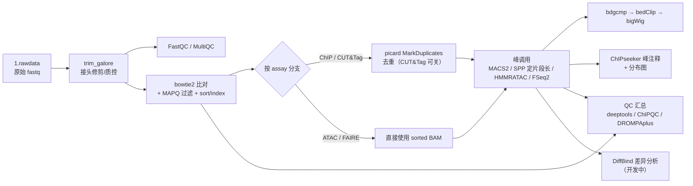

# chip_cuttag_atac_faire

基于 **Snakemake** 的植物表观组学一站式分析流程集合，支持四种相似分析范式的数据类型：

| Assay | 典型用途 | 峰调用策略 |
|---|---|---|
| **ChIP-seq** | 组蛋白修饰 / TF 结合 | MACS2（narrow：H3K27ac/H3K4me3 等；broad：H3K27me3 等） |
| **CUT&Tag** | 低背景组蛋白修饰 / TF | MACS2（通常不去重，使用 sorted BAM） |
| **ATAC-seq** | 染色质开放区 | MACS2（--shift 100 --extsize 200），可选 HMMRATAC |
| **FAIRE-seq** | 染色质开放区（历史方法） | MACS2 + FSeq2 |

默认示例参考基因组为水稻 *Oryza sativa*（IRGSP-1.0），更换物种只需修改 `config/config.yaml` 中的参考文件路径与基因组大小。

> ⚠️ **当前状态提示**：流程中 QC + 比对部分可用，峰调用及后续环节存在已知阻断性问题（详见 [docs/REVIEW.md](docs/REVIEW.md)）。修复与重构路线见 [docs/IMPROVEMENT_PLAN.md](docs/IMPROVEMENT_PLAN.md)。

---

## 1. 流程总览



**运行目录约定**（在数据工作目录生成，与分析代码目录分离）：

```
workdir/
├── 0.index/        # bowtie2 索引（可复用）
├── 1.rawdata/      # 原始数据：{sample}_1.fq.gz / {sample}_2.fq.gz
├── 2.cleandata/    # trim 后数据 + fastqc + multiqc
├── 3.align/        # bowtie2 比对：*_sorted.bam / *_rmdup.bam
├── 4.peak/         # 峰调用 + bigWig + 注释结果 anno_result/
├── 5.QC*/          # deeptools / DROMPAplus / ChIPQC 质控
├── 6.motif/        # motif 分析（规划中）
└── logs/           # 各步骤日志
```

## 2. 仓库结构

```
chip_cuttag_atac_faire/
├── workflow.smk        # （规划）统一入口；当前入口为 4 个 assay 专属 Snakefile
├── chip-seq.smk / atac.smk / cuttag.smk / faire.smk   # 各 assay 入口（待合并）
├── rules/
│   ├── upsteam.smk     # 上游：trim、fastqc、multiqc、bowtie2 index/比对
│   ├── rmDup.smk       # picard 去重（已知问题，见 REVIEW 2.2）
│   └── callpeak_*.smk  # 各 assay 峰调用规则（已知问题，见 REVIEW 2.3）
├── scripts/
│   ├── call_peak.sh         # 峰调用主脚本（SPP 片段长估计 + MACS2/HMMRATAC/FSeq2）
│   ├── bdgcmp_macs2.sh      # MACS2 bdgcmp → bigWig
│   ├── annoPeak_batch.R     # ChIPseeker 批量注释与出图
│   ├── annoPeak_single.R    # ChIPseeker 单样本注释
│   ├── run_deeptools_QC.sh  # deeptools QC（Snakemake 片段，待规则化）
│   ├── run_ChIPQC.R         # ChIPQC 报告（待修复）
│   ├── run_chipqc_DROMPAplus.sh  # DROMPAplus QC（docker）
│   └── diffpeak_DiffBind.sh / run_DiffBind.R  # 差异分析（空壳，待开发）
├── config/config.yaml       # 参考基因组与全局参数
├── sample_info.csv          # 样本信息表（schema 说明见下）
├── chip_environment.yaml    # 旧版整环境导出（将拆分为 per-rule envs/envs/*.yaml）
├── main_run.sh              # PBS 集群启动脚本
└── docs/                    # 审查报告与优化计划
```

## 3. 环境要求

- Linux + [Snakemake](https://snakemake.readthedocs.io/)（≥7，配合 `--use-conda`）
- Conda/Miniconda（Snakemake 自动创建各步骤环境；当前版本依赖 `chip_environment.yaml` 所列软件）
- 计算集群：默认按 **PBS (qsub)** 配置（`main_run.sh`），SLURM 需改 `--cluster` 参数
- 运行时工具依赖：`trim_galore`、`fastqc`、`multiqc`、`bowtie2`、`samtools`、`picard`、`macs2`、`R (ChIPseeker/GenomicFeatures)`、deeptools、SPP(phantompeakqualtools)、ucsc-tools（bedClip/bedGraphToBigWig）等

## 4. 快速开始

### 4.1 准备原始数据

将 fastq 放入工作目录 `1.rawdata/`，命名遵循 `{sample}_1.fq.gz` / `{sample}_2.fq.gz`（R1/R2 等常见后缀会在 `main_run.sh` 启动时自动 rename 成该格式）。

### 4.2 编写样本表 `sample_info.csv`

当前格式（⚠️ 后续 Phase 1 将统一为含 `role/peak_type` 的新 schema，见 [IMPROVEMENT_PLAN](docs/IMPROVEMENT_PLAN.md)）：

```csv
ids,seqtype,layout,group
IgG,chip,PAIRED,myc_IgG
myc,chip,PAIRED,myc_IgG
```

- `ids`：样本名（需与 fastq 前缀一致）；**对照组（如 IgG/Input）也要列入**，因为对照同样需要比对
- `group`：峰调用分组，约定写成 `{处理样本}_{对照样本}`（如 `myc_IgG`）
- `seqtype` / `layout`：数据类型与建库类型（当前版本由人工选择入口 Snakefile，不参与自动路由）

### 4.3 修改配置 `config/config.yaml`

```yaml
gtf: "/path/to/reference/genes.gtf"        # 基因组注释（ChIPseeker 注释用）
bed: "/path/to/reference/genes.bed"        # 基因坐标
GENOME: "/path/to/reference/genome.fa"     # bowtie2 index 构建输入
chromsize: "/path/to/reference/chrom.sizes" # bigWig 生成用染色体大小
threads: "12"                              # 每任务线程数
grouplist: "sample_info.csv"               # 样本表路径
```

### 4.4 启动

```bash
# 方式一：PBS 集群启动脚本（需先编辑其中的 smk/config 路径，见已知问题）
bash main_run.sh /path/to/workdir

# 方式二：手动运行（推荐，可控性更好）
cd /path/to/workdir
snakemake -s /path/to/repo/atac.smk \
    --configfile /path/to/repo/config/config.yaml \
    --use-conda --conda-prefix /shared/conda_envs \
    --cores 18 -j 3 -k
```

### 4.5 查看结果

| 结果 | 路径 |
|---|---|
| 质控汇总报告 | `2.cleandata/fastqc/multiqc/multiqc_report.html` |
| 比对 BAM | `3.align/bowtie2/{sample}_sorted.bam`（及 `{sample}_rmdup.bam`） |
| 峰文件 | `4.peak/{group}_MACS2_*_peaks.{narrowPeak,broadPeak}` |
| 信号轨道 bigWig | `4.peak/{group}_FE_bdgcmp.bw` |
| 峰注释表与分布图 | `4.peak/anno_result/*.Anno.xls`、`Peakanno_PeakDistributions.pdf` |
| deeptools QC（相关热图/PCA/FRiP 指纹/片段长分布） | `5.QC_deeptools/` |

## 5. QC 参考阈值

| 指标 | 参考标准 | 来源 |
|---|---|---|
| NSC（标准化链相关系数） | ≥ 1.05，理想 ≥ 1.1 | ENCODE |
| RSC（相对链相关系数） | ≥ 0.8，理想 ≥ 1 | ENCODE |
| FRiP | TF ≥ 1%（理想 5%+）；组蛋白修饰酌情放宽 | ENCODE |
| 比对率 | 常规 ≥ 70% | 经验值 |

## 6. 已知问题与路线图

- **已知问题清单**（P0~P3 分级、含文件行号定位）：[docs/REVIEW.md](docs/REVIEW.md)
- **修复与规范化计划**（Phase 0~3、验收标准）：[docs/IMPROVEMENT_PLAN.md](docs/IMPROVEMENT_PLAN.md)

主要已知问题速览：

1. 峰调用规则链尚未接入 DAG，当前入口只能跑到比对步骤；
2. `rules/rmDup.smk` 与 `rules/callpeak_*.smk` 存在语法/结构错误（`${id}`、conda 块错位等）；
3. 脚本中大量 `/home/chengyu`、`/opt`、`/share` 绝对路径，换机器必须先改；
4. 样本表 schema 与不同脚本期望不一致（Phase 1 统一）；
5. `conda: "chip"` 写法非法，需拆分为 per-rule 环境文件。

## 7. 版本与变更

见 [CHANGELOG.md](CHANGELOG.md)。原始代码快照：commit `03f5c0c`（2026-09-03 入库）。

## 8. 许可证

待定（建议 MIT 或 Apache-2.0，见优化计划 Phase 3）。
