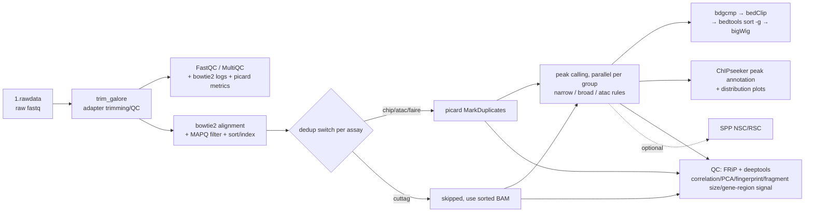

# chip_cuttag_atac_faire

A one-stop **Snakemake** workflow for plant epigenomics. The single entry point `workflow/Snakefile` supports four data types (mixed-assay projects supported):

| Assay | Typical use | Peak calling strategy | Deduplication strategy |
|---|---|---|---|
| **ChIP-seq** | Histone marks / TF binding | MACS2 (narrow: H3K27ac/H3K4me3 etc.; broad: H3K27me3 etc.) | picard deduplication |
| **CUT&Tag** | Low-background histone marks / TF | MACS2 (narrow/broad as needed) | no deduplication (PCR duplicates kept) |
| **ATAC-seq** | Open chromatin regions | MACS2 BAMPE mode (ENCODE ATAC v2 recipe; classic Tn5 offset recipe optional) | picard deduplication |
| **FAIRE-seq** | Open chromatin regions (legacy method) | same as ATAC | picard deduplication |

Deduplication strategy, peak parameters, and QC switches are configured per assay in `config/config.yaml`. The default example reference genome is rice *Oryza sativa* (IRGSP-1.0); switching species only requires changing the reference file paths (species presets in `config/species.yaml`) and the genome size.

> **Status (v0.4.0)**: engineering aligned with rna-seq v0.8.0 — unified `run.sh` ops CLI (four scheduler profiles + auto detection + preflight + resource overrides + unlock), unified environment system (`workflow/environment.yaml` all-in-one template + `config/software.yaml` to reuse existing environments/R libraries; per-rule conda removed), per-rule cluster resource model, synthetic-data dry-run regression + unit tests + CI, and four docs (README / docs/user-guide.md / CONTRIBUTING.md / CHANGELOG). All derived outputs are consolidated under the project's `results/` directory (configurable via `results_dir`). The DAG passes the CI dry-run and an independent review; for end-to-end runs see [Server validation steps](#server-validation-steps).

## Workflow overview



## Environment setup

Three ways to get an environment (pick one; details in [docs/user-guide.md](docs/user-guide.md) §1):

1. **Fresh server**: `mamba env create -f workflow/environment.yaml` (all-in-one environment `chip-cuttag-atac-faire`, pinning snakemake-minimal 7.32.4 / bowtie2 2.5.1 / macs2 2.2.7.1 / R 4.3 + ChIPseeker etc.);
2. **Reuse an existing conda environment**: in `config/software.yaml` set `environment.type: conda` + `conda_prefix` (recommended) or `conda_name`; `run.sh` injects the prefix's `bin` into PATH automatically, no activate needed;
3. **system mode + reuse the server's R libraries**: with `environment.type: system`, tools come from PATH; `r.rscript` points at Rscript and `r.lib_paths` reuses existing ChIPseeker libraries.

Environments are created explicitly by the user; Snakemake never deploys them automatically. Before launching, preflight with `bash run.sh -P <workdir> --check-software` (tools + R + R packages) or `--check-r`.

Snakemake version matrix:

| snakemake version | support | notes |
|---|---|---|
| **7.32.4** | ✅ reference version | pinned in workflow/environment.yaml; the four cluster profiles are written against the 7.x classic `--cluster` interface |
| **8.x** | ⚠️ cluster semantics unverified | parsing/lint verified; cluster submission moved to the executor plugin system — test before real cluster runs (the launcher warns automatically at startup) |
| <7 or ≥9 | ⛔ unverified | test before use |

## Quick start

The full five-step tutorial is in [docs/user-guide.md](docs/user-guide.md) (working directory → data → sample table → config → launch). Summary:

```bash
# 1) Working directory and data
mkdir -p ~/work/demo/1.rawdata
cp {sample}_1.fq.gz {sample}_2.fq.gz ~/work/demo/1.rawdata/   # _1/_2(.fq|.fastq).gz and _R1/_R2(.fq|.fastq).gz pairs are auto-detected; bash run.sh -r renames in batch

# 2) Sample table + project config (6-column schema template in config/samples.csv)
cp config/samples.csv ~/work/demo/sample_info.csv
cp config/config.yaml ~/work/demo/config.yaml                 # adjust the reference file set + genome_size (or rely on species presets)

# 3) Preflight -> dry-run -> run
bash run.sh -P ~/work/demo --check-software
bash run.sh -P ~/work/demo -n
bash run.sh -P ~/work/demo --profile auto -j 10               # cluster example: --profile pbs --queue workq --memory 16G --runtime 600
```

Key points:

- Mixed-assay projects are routed automatically by the sample table's `seqtype` column, no launcher options needed; the sample table is validated row by row with line numbers in error messages;
- Config chain: repository `config/config.yaml` → project `-c` (defaults to auto-detected `<workdir>/config.yaml`) → `config.local.yaml` (auto-layered; later files win);
- `species: "osa" | "hsa"` selects a reference preset from `config/species.yaml` (genome_fa/gtf/bed/chromsize/genome_size); explicit reference keys in the project config win over the preset;
- Cluster jobs are submitted with the per-rule resources declared in `config/resources.yaml` (`threads/mem_mb/runtime_min`); copy that file into the project as `resources.yaml` to override per rule (run.sh auto-detects it), or override globally via `--memory`/`--runtime`; the legacy top-level `threads` in config still acts as a global cap. Full options in `run.sh --help`.

## Directory structure

```
chip_cuttag_atac_faire/
├── run.sh                    # unified launcher CLI (four profiles/auto detection/preflight/--unlock; see run.sh --help)
├── workflow/
│   ├── Snakefile             # unified entry (seqtype-column routing + species presets + conditional QC includes)
│   ├── environment.yaml      # all-in-one conda environment template (pinned; created explicitly by the user)
│   ├── rules/                # common/upstream/dedup/callpeak/annotation/frip/qc_deeptools/spp_qc/meta
│   ├── scripts/              # runtime_config.py (software.yaml resolver), annoPeak_batch.R, collect_versions.py
│   ├── profile/              # default / pbs / sge / slurm profiles + README (cluster commands and pinned params)
│   └── multiqc_config.yaml
├── config/
│   ├── config.yaml           # default config (rice example via the osa preset; outputs rooted at results/)
│   ├── config.template.yaml  # override template (copy into the working directory as config.local.yaml)
│   ├── species.yaml          # species presets (osa/hsa: genome_fa/gtf/bed/chromsize/genome_size)
│   ├── resources.yaml        # per-rule scheduler resources (threads/mem_mb/runtime_min; copy as project resources.yaml to override)
│   ├── software.yaml         # unified software/R runtime (conda_prefix / system + lib_paths)
│   └── samples.csv           # sample table template (6-column mixed-assay schema)
├── tests/                    # run_tests.py (62 checks) / lint.sh / run_test.sh / make_testdata.py
├── example/                  # example project templates (real sample table + project config + one-command start guide)
├── docs/                     # user guide
├── Makefile                  # make check / lint / test
├── CHANGELOG.md
└── LICENSE                   # Apache-2.0 (CI lives at the repository root: .github/workflows/ci.yml)
```

## Results path quick reference

All derived artifacts live under `results/` in the working directory (rename via `results_dir` in config); raw inputs `1.rawdata/` stay at the working-directory root.

| Result | Path |
|---|---|
| QC summary (fastqc+bowtie2+picard+FRiP+NSC/RSC) | `results/2.cleandata/fastqc/multiqc/multiqc_report.html` |
| Alignment BAMs / dedup metrics | `results/3.align/bowtie2/{sample}_{sorted,rmdup}.bam`, `{sample}_dup_metrics.txt` |
| Peak files / summits | `results/4.peak/{group}_peaks.{narrowPeak,broadPeak}`, `{group}_summits.bed` |
| Signal-track bigWigs | `results/4.peak/{group}_FE.bw` |
| Peak annotation tables and plots | `results/4.peak/anno_result/*.Anno.xls`, `Peakanno_PeakDistributions.pdf` |
| bowtie2 index (reusable across projects) | `results/0.index/bowtie2*.bt2` |
| FRiP summary | `results/5.QC/frip/FRiP_summary.tsv` |
| NSC/RSC summary (`qc.nsc_rsc: true`) | `results/5.QC/spp/NSC_RSC_mqc.tsv` |
| deeptools QC (correlation heatmaps/PCA/fingerprints/fragment sizes/gene-region signal) | `results/5.QC/deeptools/` |
| Software version record | `results/5.QC/software_versions.yaml` |
| Per-rule logs | `results/logs/` |

## QC reference thresholds

| Metric | Reference standard | Source |
|---|---|---|
| FRiP | TF ≥ 1% (ideally 5%+); relax as appropriate for histone marks | ENCODE |
| NSC | ≥ 1.05, ideally ≥ 1.1 (with `qc.nsc_rsc` enabled) | ENCODE |
| RSC | ≥ 0.8, ideally ≥ 1 (with `qc.nsc_rsc` enabled) | ENCODE |
| Alignment rate | typically ≥ 70% | empirical |

## Documentation index

| Document | Contents |
|---|---|
| [docs/user-guide.md](docs/user-guide.md) | three environment paths, five-step quick start, sample-table schema and validation, full config key reference and resource defaults, cluster submission, result interpretation, FAQ |
| [CONTRIBUTING.md](CONTRIBUTING.md) | development workflow, CHANGELOG requirements, doc-sync checklist, testing requirements, code style |
| [workflow/profile/README.md](workflow/profile/README.md) | cluster commands and placeholder semantics for the four profiles |
| [CHANGELOG.md](CHANGELOG.md) | version change log |

## Development and testing

```bash
make check    # 62 unit tests + bash -n syntax checks (no snakemake needed)
make lint     # static check suite (bash/shellcheck/py/R/yaml/snakemake --lint; missing optional tools are skipped)
make test     # CI-equivalent full check (= check + lint)
```

Regression tests (need snakemake):

```bash
bash tests/run_test.sh               # synthetic-data dry-run: generate -> assemble working directory -> validate DAG integrity
bash tests/run_test.sh --real-run    # end-to-end run + output assertions (server validation; needs a full analysis environment)
```

Test data is generated by `tests/make_testdata.py` with a fixed seed (2 × 100kb chromosomes, 3 chip + 2 atac samples, sequences drawn from the reference genome) and is never committed. CI (repository-root `.github/workflows/ci.yml`) runs lint and a `--reads 2000` fast regression on push/PR.

### Server validation steps

CI only covers the dry-run; after deploying to a new environment/server, run one end-to-end validation in order:

```bash
bash run.sh -P /path/to/workdir --check-software     # 1) tools/R/R-package preflight
bash tests/run_test.sh --real-run                    # 2) synthetic-data end-to-end run + assertions (small sample, minutes)
bash run.sh -P /path/to/real_project -n              # 3) real-project dry-run to confirm the DAG, then the real run
```

## Known limitations and TODOs

1. **End-to-end real run pending**: CI and regression cover the dry-run level; the real-data end-to-end run (including conda environment solving and confirming the MACS2 no-control `control_lambda` outputs) follows the "Server validation steps" above and is then recorded in the CHANGELOG.
2. The bowtie2 index rule only declares `.bt2` (for references >4Gbp bowtie2 produces `.bt2l`; build the index manually and place it under `results/0.index/`).
3. **DiffBind differential analysis**: not yet implemented (contrast and design formula TBD); the former empty stub scripts (DiffBind/ChIPQC/DROMPAplus etc.) were archived out of the repository (not in version control); restore them from local archives or git history when needed.
4. Only paired-end (PE) data is supported.

## License

[Apache-2.0](LICENSE) © 2026 ChengYu

## Versions

v0.1.0 (2024-03 original implementation, archived out of the repository) → v0.2.0 (2026-09-03 refactor) → v0.4.0 (2026-09 aligned with the rna-seq engineering system: unified environment / run.sh CLI / four profiles / per-rule resources / tests and docs). Semantic version tags are maintained; see [CHANGELOG.md](CHANGELOG.md) for changes.
