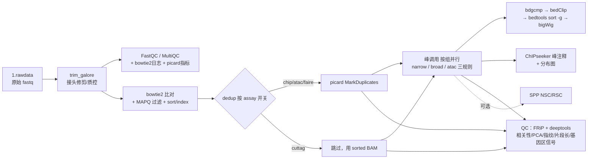

# chip_cuttag_atac_faire

基于 **Snakemake** 的植物表观组学一站式分析流程，单入口 `workflow/Snakefile` 同时支持四种数据类型（可混型项目）：

| Assay | 典型用途 | 峰调用策略 | 去重策略 |
|---|---|---|---|
| **ChIP-seq** | 组蛋白修饰 / TF 结合 | MACS2（narrow：H3K27ac/H3K4me3 等；broad：H3K27me3 等） | picard 去重 |
| **CUT&Tag** | 低背景组蛋白修饰 / TF | MACS2（narrow/broad 按需） | 不去重（保留 PCR 重复） |
| **ATAC-seq** | 染色质开放区 | MACS2 BAMPE 模式（ENCODE ATAC v2 做法；可切经典 Tn5 偏移配方） | picard 去重 |
| **FAIRE-seq** | 染色质开放区（历史方法） | 同 ATAC | picard 去重 |

去重策略、峰参数、QC 开关均按 assay 在 `config/config.yaml` 中配置。默认示例参考基因组为水稻 *Oryza sativa*（IRGSP-1.0），更换物种只需修改参考文件路径与基因组大小。

> **状态（v0.4.0）**：工程体系对齐 rna-seq v0.8.0——统一入口 `run.sh` 运维 CLI（四套调度 profile + auto 探测 + preflight + 资源覆盖 + unlock）、统一环境体系（`workflow/environment.yaml` 一体化模板 + `config/software.yaml` 复用已有环境/R 库，per-rule conda 已移除）、per-rule 集群资源模型、合成数据 dry-run 回归 + 55 项单元测试 + CI、文档四件（README / docs/使用说明.md / CONTRIBUTING.md / CHANGELOG）。DAG 已过 CI dry-run 与独立审查；端到端实跑见[服务器验证步骤](#服务器验证步骤)。

## 流程总览



## 环境准备

三条落地路径（任选其一，详见 [docs/使用说明.md](docs/使用说明.md) §1）：

1. **全新服务器**：`mamba env create -f workflow/environment.yaml`（一体化环境 `chip-cuttag-atac-faire`，钉版 snakemake-minimal 7.32.4 / bowtie2 2.5.1 / macs2 2.2.7.1 / R 4.3 + ChIPseeker 等）；
2. **复用已有 conda 环境**：`config/software.yaml` 设 `environment.type: conda` + `conda_prefix`（推荐）或 `conda_name`，`run.sh` 自动把 prefix 的 `bin` 注入 PATH，无需 activate；
3. **system 模式 + 复用服务器 R 库**：`environment.type: system` 工具走 PATH，`r.rscript` 指定 Rscript、`r.lib_paths` 复用已有 ChIPseeker 库。

环境由用户显式创建，Snakemake 不会自动部署；启动前用 `bash run.sh -P <workdir> --check-software`（工具 + R + R 包）或 `--check-r` 预检。

Snakemake 版本矩阵：

| snakemake 版本 | 支持情况 | 说明 |
|---|---|---|
| **7.32.4** | ✅ 参考版本 | workflow/environment.yaml 钉版版本；四套集群 profile 按 7.x 经典 `--cluster` 接口编写 |
| **8.x** | ⚠️ 集群语义未验证 | 解析/lint 级已验证；集群提交改为 executor 插件体系，实跑前先测（launcher 启动时自动告警） |
| <7 或 ≥9 | ⛔ 未验证 | 需实测 |

## 快速开始

完整五步教程见 [docs/使用说明.md](docs/使用说明.md)（工作目录 → 数据 → 样本表 → config → 启动），概要：

```bash
# 1) 工作目录与数据
mkdir -p ~/work/demo/1.rawdata
cp {sample}_1.fq.gz {sample}_2.fq.gz ~/work/demo/1.rawdata/   # 常见 R1/R2 后缀可 bash run.sh -r 批量重命名

# 2) 样本表 + 项目配置（6 列 schema 模板见 config/samples.csv）
cp config/samples.csv ~/work/demo/sample_info.csv
cp config/config.yaml ~/work/demo/config.yaml                 # 改参考四件套 + genome_size

# 3) 预检 → dry-run → 运行
bash run.sh -P ~/work/demo --check-software
bash run.sh -P ~/work/demo -n
bash run.sh -P ~/work/demo --profile auto -j 10               # 集群示例：--profile pbs --queue workq --memory 16G --runtime 600
```

要点：

- 混型项目按样本表 `seqtype` 列自动路由，无需启动选项；样本表逐行校验、错误信息含行号；
- 配置链：仓库 `config/config.yaml` → 项目 `-c`（缺省自动探测 `<workdir>/config.yaml`）→ `config.local.yaml`（自动叠加，后者优先）；
- 集群资源默认按各规则 `resources` 声明提交，可用 config `resources:` 段按规则覆盖、`--memory`/`--runtime` 全局覆盖；完整选项见 `run.sh --help`。

## 目录结构

```
chip_cuttag_atac_faire/
├── run.sh                    # 统一启动 CLI（四 profile/auto 探测/preflight/--unlock，见 run.sh --help）
├── workflow/
│   ├── Snakefile             # 统一入口（seqtype 列自动路由 + 条件 include QC 模块）
│   ├── environment.yaml      # 一体化 conda 环境模板（钉版；用户显式创建）
│   ├── rules/                # common/upstream/dedup/callpeak/annotation/frip/qc_deeptools/spp_qc/meta
│   ├── scripts/              # runtime_config.py（software.yaml 解析）、annoPeak_batch.R、collect_versions.py
│   ├── profile/              # default / pbs / sge / slurm 四套 profile + README（cluster 串与固参数）
│   └── multiqc_config.yaml
├── config/
│   ├── config.yaml           # 默认配置（水稻 IRGSP-1.0 示例；resources 覆盖段注释示例）
│   ├── config.template.yaml  # 覆盖模板（复制为工作目录 config.local.yaml）
│   ├── software.yaml         # 统一软件/R runtime（conda_prefix / system + lib_paths）
│   └── samples.csv           # 样本表模板（6 列混型 schema）
├── tests/                    # run_tests.py（55 项）/ lint.sh / run_test.sh / make_testdata.py
├── example/                  # 示例项目模板（真实样本表 + 项目 config + 一条命令启动指引）
├── docs/                     # 使用说明（用户指南）
├── Makefile                  # make check / lint / test
├── CHANGELOG.md
└── .github/workflows/ci.yaml # CI：lint（check+lint.sh）+ 合成数据 dry-run 回归
```

## 结果路径速查

| 结果 | 路径 |
|---|---|
| 质控汇总（fastqc+bowtie2+picard+FRiP+NSC/RSC） | `2.cleandata/fastqc/multiqc/multiqc_report.html` |
| 比对 BAM / 去重指标 | `3.align/bowtie2/{sample}_{sorted,rmdup}.bam`、`{sample}_dup_metrics.txt` |
| 峰文件 / summits | `4.peak/{group}_peaks.{narrowPeak,broadPeak}`、`{group}_summits.bed` |
| 信号轨道 bigWig | `4.peak/{group}_FE.bw` |
| 峰注释表与分布图 | `4.peak/anno_result/*.Anno.xls`、`Peakanno_PeakDistributions.pdf` |
| FRiP 汇总 | `5.QC/frip/FRiP_summary.tsv` |
| NSC/RSC 汇总（`qc.nsc_rsc: true`） | `5.QC/spp/NSC_RSC_mqc.tsv` |
| deeptools QC（相关热图/PCA/指纹/片段长/基因区信号） | `5.QC_deeptools/` |
| 软件版本记录 | `5.QC/software_versions.yaml` |

## QC 参考阈值

| 指标 | 参考标准 | 来源 |
|---|---|---|
| FRiP | TF ≥ 1%（理想 5%+）；组蛋白修饰酌情放宽 | ENCODE |
| NSC | ≥ 1.05，理想 ≥ 1.1（开启 `qc.nsc_rsc`） | ENCODE |
| RSC | ≥ 0.8，理想 ≥ 1（开启 `qc.nsc_rsc`） | ENCODE |
| 比对率 | 常规 ≥ 70% | 经验值 |

## 文档索引

| 文档 | 内容 |
|---|---|
| [docs/使用说明.md](docs/使用说明.md) | 环境三条落地路径、五步快速开始、样本表 schema 与校验、config 全键与资源默认值、集群提交、结果解读、FAQ |
| [CONTRIBUTING.md](CONTRIBUTING.md) | 开发流程、CHANGELOG 要求、文档同步 checklist、测试要求、代码风格 |
| [workflow/profile/README.md](workflow/profile/README.md) | 四套 profile 的 cluster 串与占位符说明 |
| [CHANGELOG.md](CHANGELOG.md) | 版本变更记录 |

## 开发与测试

```bash
make check    # 55 项单元测试 + bash -n 语法检查（无需 snakemake）
make lint     # 静态检查套件（bash/shellcheck/py/R/yaml/snakemake --lint，缺可选工具自动跳过）
make test     # CI 同款全量检查（= check + lint）
```

回归测试（需 snakemake）：

```bash
bash tests/run_test.sh               # 合成数据 dry-run：生成 → 组装工作目录 → 验证 DAG 完整性
bash tests/run_test.sh --real-run    # 端到端实跑 + 产物断言（服务器验证用，需完整分析环境）
```

测试数据由 `tests/make_testdata.py` 固定种子生成（2 条 100kb 染色体，chip 3 样本 + atac 2 样本，序列真实取自参考基因组），不入库。CI（`.github/workflows/ci.yaml`）在 push/PR 时执行 lint 与 `--reads 2000` 的快速回归。

### 服务器验证步骤

CI 只覆盖 dry-run；新环境/新服务器部署后按序执行一次端到端验证：

```bash
bash run.sh -P /path/to/workdir --check-software     # 1) 工具/R/R 包预检
bash tests/run_test.sh --real-run                    # 2) 合成数据端到端实跑 + 断言（小样本，分钟级）
bash run.sh -P /path/to/real_project -n              # 3) 真实项目 dry-run 确认 DAG 后正式运行
```

## 已知限制与待办

1. **端到端实跑待完成**：CI 与回归覆盖 dry-run 级；真实数据端到端实跑（含 conda 环境求解、MACS2 无对照 `control_lambda` 产出确认）按上方"服务器验证步骤"执行后记入 CHANGELOG。
2. bowtie2 索引规则只声明 `.bt2`（参考组 >4Gbp 时 bowtie2 产出 `.bt2l`，需手动建索引后放入 `0.index/`）。
3. **DiffBind 差异分析**：待实现（contrast 与设计公式待定）；原空壳脚本（DiffBind/ChIPQC/DROMPAplus 等）已移出仓库归档（不入版本库），需要时从本地归档或 git 历史恢复。
4. 仅支持双端（PE）数据。

## 许可证

[Apache-2.0](LICENSE) © 2026 ChengYu

## 版本

v0.1.0（2024-03 原始实现，已归档出库）→ v0.2.0（2026-09-03 重构）→ v0.4.0（2026-09 对齐 rna-seq 工程体系：统一环境 / run.sh CLI / 四 profile / per-rule 资源 / 测试与文档）。语义化版本 tag 维护，变更见 [CHANGELOG.md](CHANGELOG.md)。
